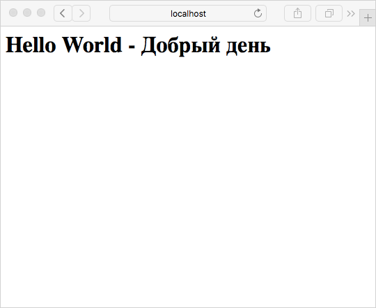

= Using Spring Boot with JSPs in Executable Jars
Gunnar Hillert <doc.writer@asciidoctor.org>
v1.0, 2016-04-03
:toc: macro
:toclevels: 5

toc::[]

[[spring-boot-jsp-repo]]
== Sample Repository

This sample repository is available at: https://github.com/ghillert/spring-boot-jsp-demo

[cols="2*", width="50%"]
|===
|Build Status
|image:https://travis-ci.org/ghillert/spring-boot-jsp-demo.svg?branch=master["Build Status", link="https://travis-ci.org/ghillert/spring-boot-jsp-demo"]
|===

This repository contains the following 2 examples:

* _jsp-demo-tomcat_   - Demonstrates using JSPs and http://projects.spring.io/spring-boot/[Spring Boot] executable Jars using http://tomcat.apache.org/[Tomcat]
* _jsp-demo-undertow_ - Demonstrates using JSPs and http://projects.spring.io/spring-boot/[Spring Boot] executable Jars using http://undertow.io/[Undertow]

[[spring-boot-jsp-introduction]]
== Introduction

As you may know, I am a co-organizer for the https://www.devnexus.com/[DevNexus conference], the second-largest enterprise Java conference in North-America in Atlanta, GA. Together with https://twitter.com/summerspittman[Summers Pittman], I also maintain the https://github.com/devnexus/devnexus-site[Spring-based web-application] that drives the website, schedule, call-for-paper (CFP) process and nowadays ticket registrations as well.

[[spring-boot-jsp-goal]]
== Goal

When we started planing for DevNexus 2016, I wanted to modernize the DevNexus application. Specifically, I planned to improve the underlying infrastructure of the app.

The goal was to move away from a stand-alone http://tomcat.apache.org/[Tomcat-based] servlet-container, which we had been using for the past couple of years. We endured several minutes of down-time whenever a new version of the app was deployed. Sometimes, the Tomcat instance or the server itself gave us grief. Furthermore, I longed for the ability to make https://docs.pivotal.io/pivotalcf/devguide/deploy-apps/blue-green.html[blue/green deployments].

Therefore, the goal emerged to move the application over to a _Platform as a Service_ (PaaS) offering, specifically https://run.pivotal.io/[Pivotal Web Services] (PWS). I did not want to worry any longer about infrastructure issues, and blue/green deployments would be a breeze to accomplish using PWS.

In order to make this all happen, it became apparent, that migrating the application to http://projects.spring.io/spring-boot/[Spring Boot] would help in that endeavor. Luckily the application was generally architected in a way that made the migration to Spring Boot fairly straightforward. The migration also would simplify things greatly overall as we could take full advantage of Spring Boot's defaults and also remove some duplicate functionality that was already baked into Spring Boot.

*One main sticking point*, though, was the used view technology. The DevNexus application has been using _JavaServer Pages_ (JSP) for several years, and we accumulated a non-trivial amount of them. Ultimately, the plan is to migrate the user interface (UI) to a Single Page Application (SPA) but for the 2016 conference (February) that intent was unattainable due to time constraints.

Therefore, the whole migration was a bit in perils initially. As of the current version of Spring Boot at the time of this blog post `1.3.3`, the http://docs.spring.io/spring-boot/docs/1.3.3.RELEASE/reference/htmlsingle/[reference guide] states:

[quote, Spring Boot Reference Guide (version 1.3.3)]
____
JSPs should be avoided if possible, there are several known limitations when using them with embedded servlet containers.
____

The reference guide then goes on to provide a list of *JSP limitations* in http://docs.spring.io/spring-boot/docs/current/reference/htmlsingle/#boot-features-jsp-limitations[chapter 27.3.5]. Specifically it states that:

____
An executable jar will not work because of a hard coded file pattern in Tomcat.
____

What a bummer…

[[spring-boot-jsp-solution]]
== Solution using Tomcat

Just to recap my requirement, I want to serve JSPs out of my classpath so that I can create executable Jar files. Basically, _Eliminate the webapps folder_.

[NOTE]
====
An interesting aspect of this is, that one can compose web applications out of multiple JARs, each possibly containing JSPs that are automatically served.
====

Unfortunately, taking my Maven-based project, putting your JSPs into e.g. `src/main/resources/public` or `src/main/resources/static` does **not** work. While reading the https://jcp.org/aboutJava/communityprocess/mrel/jsr245/index2.html[JSR-245 JavaServer™ Pages 2.1 Specification] as well as the following in interesting blog post titled https://alexismp.wordpress.com/2010/04/28/web-inflib-jarmeta-infresources/[Serving Static Content with Servlet 3.0], it became apparent that I should also be able to store static resources in the `META-INF/resources` directory. Heureka it worked!

So the simple thing to remember is to store your JSPs in a folder like `/src/main/resources/META-INF/resources/WEB-INF/jsp` and you're good to go (Plus some minor configuration around). To make things easy, lets go over a little example project.

[[spring-boot-jsp-sample-project-spring-initializr]]
=== Getting started with Spring Initializr

The best way to start a Spring Boot project is to head over to http://start.spring.io/. Using https://github.com/spring-io/initializr/[Spring Initializr] underneath, the website lets you customize and create Spring Boot starter projects. For our requirement, we want to create a simple `web` project.

image::images/spring-initializr.png[Create starter project using spring initializr]

Selecting `web` enables _Full-stack web development with Tomcat and Spring MVC_. Now you can press the `Generate Project` button, which will start the download of a Zip file containing your customized project.

[NOTE]
====
Instead of following the individual steps, you can also download the fully configured sample project from GitHub. Just clone the https://github.com/ghillert/spring-boot-jsp-demo[Demo Project] using:

```shell
$ git clone https://github.com/ghillert/spring-boot-jsp-demo.git
$ cd spring-boot-jsp-demo/jsp-demo-tomcat
```
====

Unzip the project to a directory of your choosing and cd into `jsp-demo-tomcat`.

[[spring-boot-jsp-sample-project-mave]]
=== Add Maven Dependencies

In order to enable JSP support using Tomcat we need to add a few dependencies to
our new project in `pom.xml`.

```xml
<dependency>
	<groupId>org.apache.tomcat.embed</groupId>
	<artifactId>tomcat-embed-jasper</artifactId>
</dependency>
<dependency>
	<groupId>javax.servlet</groupId>
	<artifactId>jstl</artifactId>
</dependency>
```

[[spring-boot-jsp-sample-project-template-location]]
=== Define the location of your JSP templates

Next we need to define the template prefix and suffix for our JSP files in `application.properties`. Thus add:

```
spring.mvc.view.prefix=/WEB-INF/jsp/
spring.mvc.view.suffix=.jsp
```

IMPORTANT: Keep in mind that we will ultimately, place the JSP templates under `src/main/resources/META-INF/resources/WEB-INF/jsp/`

[[spring-boot-jsp-sample-project-controller]]
=== Create a Spring Web Controller

Create a simple web controller:

```java
package com.dip.controller;

import org.springframework.stereotype.Controller;
import org.springframework.ui.Model;
import org.springframework.web.bind.annotation.RequestMapping;

@Controller
public class HelloWorldController {

	@RequestMapping("/")
	public String helloWorld(Model model) {
		model.addAttribute("russian", "Добрый день");
		return "hello-world";
	}

}

```

[[spring-boot-jsp-sample-project-template]]
=== Create the JSP Template

Next, create the corresponding JSP file `hello-world.jsp` in the directory `src/main/resources/META-INF/resources/WEB-INF/jsp/`:

```html
<%@ page language="java" contentType="text/html; charset=UTF-8" pageEncoding="UTF-8" %><%
response.setHeader("Cache-Control","no-cache");
response.setHeader("Pragma","no-cache");
response.setHeader("Expires","0");

%><%@ taglib uri="http://java.sun.com/jsp/jstl/core" prefix="c" %>
<%@ taglib uri="http://java.sun.com/jsp/jstl/fmt" prefix="fmt" %>
<%@ taglib uri="http://java.sun.com/jsp/jstl/functions" prefix="fn" %>

<%@ taglib prefix="spring" uri="http://www.springframework.org/tags"%>
<%@ taglib prefix="form"   uri="http://www.springframework.org/tags/form" %>

<c:set var="ctx" value="${pageContext['request'].contextPath}"/>
<html>
	<body>
		<h1>Hello World - ${russian}</h1>
	</body>
</html>
```

[[spring-boot-jsp-sample-project-running]]
=== Run the Sample Application

Now it is time to run the application - execute:

```shell
$ mvn clean package
$ java -jar jsp-demo-tomcat/target/jsp-demo-tomcat-1.0.0-BUILD-SNAPSHOT.jar
```
In your console you should start seeing how the application starts up.


Once started, open your browser and go to the following Url http://localhost:8080/

[[spring-boot-jsp-sample-jetty]]
== What about Jetty?

I still need to look more closely at Jetty. Consider it "Work in Progress". Below
you will find a a few pointers on the subject:

* https://github.com/jetty-project/embedded-jetty-jsp
* https://dev.eclipse.org/mhonarc/lists/jetty-dev/msg00903.html
* https://www.totaalsoftware.com/blog/104-jetty-with-servlet-3-0-external-resources
* https://github.com/jetty-project/embedded-jetty-jsp
* https://github.com/spring-projects/spring-boot/issues/367

[[spring-boot-jsp-sample-undertow]]
== What about Undertow?

http://undertow.io/[Undertow] is another alternative for using an embedded container
with Spring Boot. You can find general information in the Spring Boot reference
guide chapter
https://docs.spring.io/spring-boot/docs/current/reference/html/howto-embedded-servlet-containers.html#howto-use-undertow-instead-of-tomcat[Use Undertow instead of Tomcat].

While I was working on updating the Spring Boot documentation regarding the JSP support
for Tomcat, I noticed the following line in the reference guide for Spring Boot `1.3.3`:

[quote, Spring Boot Reference Guide (version 1.3.3)]
____
Undertow does not support JSPs.
____

Being a good citizen, I dug a little deeper and discovered the
https://github.com/fourcube/undertow-jsp-sample[Undertow JSP sample] application by
https://fourcube.github.io/[Chris Grieger]. It turns out that Undertow has indeed
JSP support by using https://github.com/undertow-io/jastow[jastow], which is a
Jasper fork for Undertow. The key was to adapt the
https://github.com/ghillert/spring-boot-jsp-demo/tree/master/jsp-demo-undertow[Undertow JSP sample application
for Spring Boot].

Doing so was actually fairly straightforward. The actual Undertow configuration
uses Spring Boot`s
`https://docs.spring.io/spring-boot/docs/current/api/org/springframework/boot/context/embedded/EmbeddedServletContainerCustomizer.html[EmbeddedServletContainerCustomizer]`:

```java
final UndertowDeploymentInfoCustomizer customizer = new UndertowDeploymentInfoCustomizer() {

	@Override
	public void customize(DeploymentInfo deploymentInfo) {
		deploymentInfo.setClassLoader(JspDemoApplication.class.getClassLoader())
		.setContextPath("/")
		.setDeploymentName("servletContext.war")
		.setResourceManager(new DefaultResourceLoader(JspDemoApplication.class))
		.addServlet(JspServletBuilder.createServlet("Default Jsp Servlet", "*.jsp"));

		final HashMap<String, TagLibraryInfo> tagLibraryInfo = TldLocator.createTldInfos();

		JspServletBuilder.setupDeployment(deploymentInfo, new HashMap<String, JspPropertyGroup>(), tagLibraryInfo, new HackInstanceManager());

	}
};
```

The full source is available in the
`https://github.com/ghillert/spring-boot-jsp-demo/blob/master/jsp-demo-undertow/src/main/java/com/hillert/JspDemoApplication.java[JspDemoApplication]`
class.

The main issue is more or less the retrieval and configuration of the used Taglibraries.
The Undertow JSP sample provides the https://github.com/fourcube/undertow-jsp-sample/blob/master/src/main/java/com/grieger/sample/undertow/TldLocator.java[TldLocator]
class, which does the heavy lifting. For our example, I am [adapting that class] so that
it works in the context of Spring Boot.

In Spring Boot we are dealing with
http://stackoverflow.com/questions/11947037/what-is-an-uber-jar[über-Jars], meaning
the resulting executable jar file will contain other jar files representing its
dependencies.

Spring provides some nifty helpers to retrieve the needed Tag Library Descriptors (TLD) files.

In `TldLocator#createTldInfos` I use a `ResourcePatternResolver`, specifically
a `PathMatchingResourcePatternResolver` with a location pattern of `classpath*:**/*.tld`.

```java
final URLClassLoader loader = (URLClassLoader) Thread.currentThread().getContextClassLoader();

final ResourcePatternResolver resolver = new PathMatchingResourcePatternResolver(loader);
final Resource[] resources;
final String locationPattern = "classpath*:**/*.tld";

try {
	resources = resolver.getResources(locationPattern);
}
catch (IOException e) {
	throw new IllegalStateException(String.format("Error while retrieving resources"
			+ "for location pattern '%s'.", locationPattern, e));
}
```

[IMPORTANT]
====
Don't forget the asterix right after `classpath`. The `classpath*:` allows you
to retrieve multiple class path resources with the same name. It will also retrieve
resources across multiple jar files. This is an extremely useful feature. For more information
please see the relavent JavaDocs for
http://docs.spring.io/autorepo/docs/spring-framework/current/javadoc-api/org/springframework/core/io/support/PathMatchingResourcePatternResolver.html[PathMatchingResourcePatternResolver].
====

Once we have the TLD resources, they will be parsed and ultimately used to create
a collection of `org.apache.jasper.deploy.TagLibraryInfo`.

With those at hand, we create a JSP deployment for Undertow using the DeploymentInfo
and the `TagLibraryInfo` collection.

```java
final HashMap<String, TagLibraryInfo> tagLibraryInfo = TldLocator.createTldInfos();

JspServletBuilder.setupDeployment(deploymentInfo, new HashMap<String, JspPropertyGroup>(), tagLibraryInfo, new HackInstanceManager());
```
And that's it. Simply build and run the application and you should have a working
JSP-based application.

```shell
$ mvn clean package
$ java -jar jsp-demo-tomcat/target/jsp-demo-tomcat-1.0.0-BUILD-SNAPSHOT.jar
```
In your console you should start seeing how the application starts up.


Once started, open your browser and go to the following Url http://localhost:8080/.



[[spring-boot-jsp-sample-conclusion]]
== Conclusion

In this blog post I have shown how easy it is to use JSP templates with Spring Boot in executable Jars by simply putting your templates into `src/main/resources/META-INF/resources/WEB-INF/jsp/`.

While JSPs are often touted as being *legacy*, I see several reasons why they stay relevant today (2016):

* You need to migrate an application to Spring Boot but have an existing sizable investment in JSP templates, that can't be migrated immediately (My use-case)
* While Single Page Applications (SPA) are all the rage, you may have use-cases where the traditional Spring Web MVC approach is still relevant
* Even for SPA scenarios, you may still use dynamically-created wrapper pages (e.g. to inject data into the *zero-payload* HTML file)
* Also JSP are battle-tested in http://www.ebaytechblog.com/2013/01/04/tomcatjasper-performance-tuning/[large scale environments], e.g. at Ebay
* Even with alternative frameworks, https://github.com/thymeleaf/thymeleaf/issues/390[you may run into issues]

In any event, I hope this expands your toolbox when using Spring Boot. There is simply no reason why you shouldn't enjoy the benefits of Spring Boot to the fullest extent permissible by law. Remember, https://twitter.com/springcentral/status/598910532008062976[Make JAR, not WAR].

